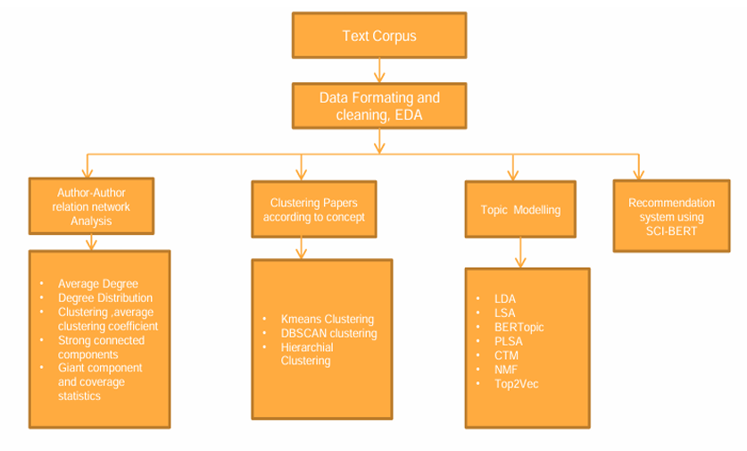

# Exploring COVID Scientometrics Data: Topic Modeling and Query-Driven Recommendations

This project analyzes the COVID-19 Open Research Dataset (CORD-19) using advanced scientometric techniques. The work focuses on topic modeling, clustering, and recommendation systems to provide insights into the vast corpus of COVID-19-related scientific literature.

## Table of Contents
1. [Introduction](#introduction)
2. [Features](#features)
3. [Methodology](#methodology)
4. [Future Scope](#future-scope)
5. [Contributors](#contributors)

## Introduction

The COVID-19 pandemic has resulted in a significant increase in scientific research. This project aims to:
- Conduct exploratory data analysis (EDA) on CORD-19 data.
- Implement clustering and topic modeling techniques.
- Develop a SciBERT-based query-driven recommendation system for researchers.

The primary dataset contains 970,836 articles, focusing on titles, abstracts, and author details.

## Features
- **Author-Author Graph Analysis**: Explore collaboration networks within the dataset.
- **Clustering**: Group documents using techniques like K-Means, DBSCAN, and Hierarchical Clustering.
- **Topic Modeling**: Analyze topics with models such as LDA, CTM, BERTopic, and more.
- **Recommendation System**: Use SciBERT embeddings to provide query-driven recommendations.

## Methodology

The methodology employed in this project encompasses the following steps:

1. **Author-Author Graph Analysis**:
   - Built collaboration networks among researchers using graph-based visualization.

2. **Clustering Papers According to Concept**:
   - **K-Means Clustering**: Documents grouped into clusters based on TF-IDF vector similarity.
   - **DBSCAN**: Density-based clustering to identify tightly-knit document groups.
   - **Hierarchical Clustering**: Clustered documents using a dendrogram for hierarchical insights.

3. **Topic Modeling**:
   - Techniques like LDA, CTM, and BERTopic were used to extract topics from the corpus.

4. **Recommendation System**:
   - SciBERT was used to build a query-driven recommendation system based on cosine similarity.

## Usage
- **Clustering**: Visualize clusters using pre-defined notebooks.
- **Topic Modeling**: Extract and compare topics with different algorithms.
- **Recommendation System**: Provide scientific queries to retrieve relevant articles.

## Future Scope
- Integrating multimodal data (e.g., citation networks, author affiliations).
- Advanced semantic search and query expansion.
- Interactive visualization tools for topic exploration.
- Knowledge graph integration for enhanced context.

## Contributors
- A D Mahit Nandan (211AI001)
- Prathipati Jayanth (211AI027)
  
Under the guidance of Dr. Sowmya Kamath S, Department of IT, NITK Surathkal.
